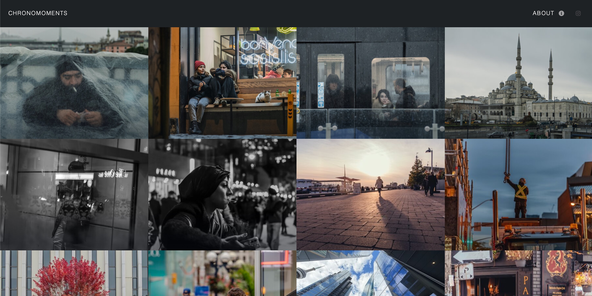

# Setup and Run on Debian Linux (VPS)

Step-by-step instructions to build and serve this Jekyll photography site on a fresh Debian installation, using virtual environments where applicable. The site is built into `_site` and served with nginx.


**Project stack:** Jekyll (Ruby) + Node.js (gulp) for the build.

---

## 1. System Prerequisites

On a fresh Debian (e.g. Trixie):

```bash
sudo apt update && sudo apt upgrade -y
sudo apt install -y build-essential curl imagemagick
```

ImageMagick is required for the image resize task (`npx gulp resize`); the build script uses `convert` and `identify`.

### Install GitHub CLI (gh)

```bash
type -p curl >/dev/null || sudo apt install -y curl
curl -fsSL https://cli.github.com/packages/githubcli-archive-keyring.gpg | sudo dd of=/usr/share/keyrings/githubcli-archive-keyring.gpg
sudo chmod go+r /usr/share/keyrings/githubcli-archive-keyring.gpg
echo "deb [arch=$(dpkg --print-architecture) signed-by=/usr/share/keyrings/githubcli-archive-keyring.gpg] https://cli.github.com/packages stable main" | sudo tee /etc/apt/sources.list.d/github-cli.list > /dev/null
sudo apt update
sudo apt install -y gh
```

---

## 2. Install Ruby (for Jekyll)

### rbenv with Ruby 4 (isolated, venv-like)

On small VPS, `/tmp` can be too small for building Ruby; use a user temp dir:

```bash
mkdir -p $HOME/tmp
export TMPDIR=$HOME/tmp
```

Then install rbenv and Ruby:

```bash
# Install rbenv
curl -fsSL https://github.com/rbenv/rbenv-installer/raw/HEAD/bin/rbenv-installer | bash
echo 'export PATH="$HOME/.rbenv/bin:$PATH"' >> ~/.bashrc
echo 'eval "$(rbenv init -)"' >> ~/.bashrc
source ~/.bashrc

# Install Ruby 4 build dependencies
sudo apt install -y libssl-dev libreadline-dev zlib1g-dev libyaml-dev libffi-dev libgmp-dev autoconf

# Install Ruby 4 (Jekyll 4.3 is compatible with Ruby 4)
rbenv install 4.0.1
rbenv global 4.0.1

# Install bundler
gem install bundler
```
---

## 3. Install Node.js (for gulp build)

### nvm (isolated, venv-like)

```bash
curl -o- https://raw.githubusercontent.com/nvm-sh/nvm/v0.39.7/install.sh | bash
source ~/.bashrc
nvm install --lts
nvm use --lts
```
---

## 4. Clone and Enter Project

Authenticate with GitHub (one-time):

```bash
gh auth login
```

Clone the repo:

```bash
gh repo clone maysamsh/photography-portfolio
cd photography-portfolio
```

---

## 5. Install Dependencies

### Ruby gems (Jekyll)

Install gems into the project (avoids system directory permission issues):

```bash
bundle config set --local path 'vendor/bundle'
bundle install
```

### Node.js packages (gulp, sass, etc.)

```bash
npm install
```

---

## 6. Configure for Production

Edit `_config.yml` if needed:

- `baseurl: ""` — for serving at domain root (e.g. yarmara.uk)
- `url: "https://yarmara.uk"` — your canonical URL (use your domain)

There are other parameters available in the file to change the rendering of the site, such as sorting, colours, social network links, etc.
---

## 7. Build the Site

The build has two steps: gulp (assets) then Jekyll (HTML):

```bash
# 1. Compile SASS, minify JS, resize images
npm run sass    # or: npx gulp sass
npx gulp minify-js
npx gulp resize   # optional; only if you have images in images/

# Or run the default gulp task (sass + minify-js + resize):
npx gulp

# 2. Generate static site into _site
bundle exec jekyll build
```

**One-liner build:**

```bash
npx gulp && bundle exec jekyll build
```

---

## 8. Verify `_site`

Check that `_site` contains the built site:

```bash
ls -la _site/
# Should see index.html, assets/, images/, etc.
```

---

## 9. Install and Configure nginx

### Install nginx

```bash
sudo apt install -y nginx
```

### Deploy `_site` so nginx can serve it

Nginx runs as `www-data` and must be able to read the files. Create a symlink so nginx serves `_site` directly (no copy step after each rebuild):

```bash
sudo mkdir -p /var/www
sudo ln -s /home/maysam/photography-portfolio/_site /var/www/photography-portfolio
```

www-data must be able to traverse each directory in the path. Typically only `/home/maysam` blocks (it's 700 by default). Adjust the path if your username differs:

```bash
chmod 755 /home/maysam
chmod 755 /home/maysam/photography-portfolio
chmod 755 /home/maysam/photography-portfolio/_site
```

### Create site config

```bash
sudo nano /etc/nginx/sites-available/photography-portfolio
```

Paste (root must point to the deployed `_site`). Replace `yarmara.uk` if using a different domain:

```nginx
server {
    listen 80 default_server;
    server_name yarmara.uk www.yarmara.uk _;
    root /var/www/photography-portfolio;
    index index.html;

    location / {
        try_files $uri $uri/ $uri.html =404;
    }

    # Cache static assets
    location ~* \.(css|js|jpg|jpeg|png|gif|ico|svg|webp|woff2)$ {
        expires 1y;
        add_header Cache-Control "public, immutable";
    }
}
```

### Enable site and reload nginx

```bash
sudo ln -s /etc/nginx/sites-available/photography-portfolio /etc/nginx/sites-enabled/
sudo rm -f /etc/nginx/sites-enabled/default
sudo nginx -t
sudo systemctl reload nginx
```

**Note:** Removing the default site prevents the "Welcome to nginx" page. The `default_server` and `server_name _` make your site respond to requests by IP (e.g. `http://192.168.2.232`) before a domain is configured.

---

## 10. Connect the Domain (Cloudflare → VPS)

Point yarmara.uk to your VPS so traffic reaches the server. VPS IP: `159.203.46.199`.

1. Log in to [Cloudflare](https://dash.cloudflare.com) and select the zone for yarmara.uk.
2. Go to **DNS** → **Records**.
3. Add or update these records:

   | Type | Name | Content           | Proxy status |
   |------|------|-------------------|--------------|
   | A    | `@`  | `159.203.46.199`  | Proxied or DNS only |
   | A    | `www`| `159.203.46.199`  | Proxied or DNS only |

   (Or use a CNAME for `www` → `yarmara.uk` instead of a second A record.)

4. Save. DNS propagation can take a few minutes; verify with `dig yarmara.uk` or `nslookup yarmara.uk`.

---

## 11. TLS with Let's Encrypt

If using a domain (e.g. yarmara.uk), obtain free SSL certificates:

```bash
sudo apt install -y certbot python3-certbot-nginx
sudo certbot --nginx -d yarmara.uk -d www.yarmara.uk
```

Replace `yarmara.uk` with your domain in both the nginx `server_name` (section 9) and the certbot command above.

---
## Favicon

Want your own icon in the browser tab? Use [favicon.io](https://favicon.io): pick the image converter, upload a **512×512** image (or use their text/emoji generators if you prefer), then download the zip. Drop the files from the zip into your project root and overwrite the existing ones (`apple-touch-icon.png`, `favicon-32x32.png`, `favicon-16x16.png`, and `site.webmanifest` if you got it). Rebuild the site and you’re done.

## Quick Reference

| Step          | Command                                      |
|---------------|----------------------------------------------|
| Full build    | `npx gulp && bundle exec jekyll build`       |
| Rebuild after content changes | `bundle exec jekyll build`          |
| Rebuild after theme/CSS changes | `npx gulp && bundle exec jekyll build` |

---

## Troubleshooting

- **rbenv / Ruby build fails on small VPS (disk space, "No space left", or similar):** Use a user temp dir before building: `mkdir -p $HOME/tmp` and `export TMPDIR=$HOME/tmp`. Re-run `rbenv install 4.0.1` (or your Ruby version).
- **`Bundler::PermissionError` or "Don't run Bundler as root":** Use `bundle config set --local path 'vendor/bundle'` before `bundle install` so gems install into the project instead of system directories.
- **Permission error writing to `Gemfile.lock` or project files:** The project directory may be owned by root (e.g. from a previous `sudo`). Fix ownership: `sudo chown -R $USER:$USER /path/to/chronomoments`
- **`bundle exec jekyll build` fails:** Ensure Ruby 2.7+ (or 4.x) and `bundle install` completed.
- **`npx gulp` fails:** Ensure `npm install` ran and Node.js is LTS.
- **`npx gulp resize` fails (e.g. "convert: not found" or "identify: not found"):** Install ImageMagick: `sudo apt install -y imagemagick`.
- **404 on all pages:** (1) Ensure `root` in nginx config points to the actual `_site` directory (e.g. `/var/www/photography-portfolio`). (2) Symlink `_site` to `/var/www/` so `www-data` can read it—files in `/home/username/` often block nginx. (3) Run `chmod 755` on the path so www-data can traverse to `_site`.
- **404 on subpages only:** nginx `try_files` should include `$uri.html` for Jekyll pretty URLs.
- **Blank CSS:** Run `npx gulp sass` before `jekyll build`.

---

## Credits

This project is based on [rampatra/photography](https://github.com/rampatra/photography), a free Jekyll portfolio for photographers. I took it and improved it for my own use.
